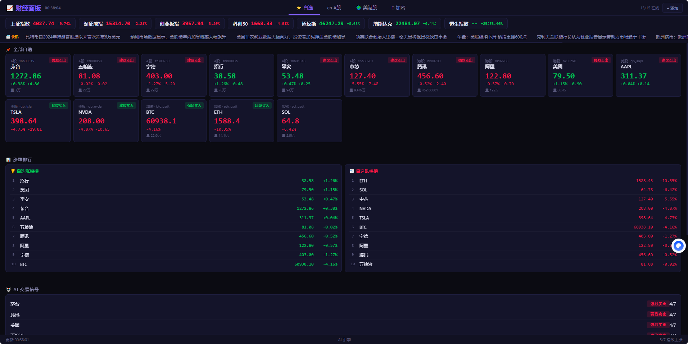

# 📈 Financial Monitor — 桌面财经面板

实时监控 **A股 / 港股 / 美股 / 外汇 / 大宗商品 / 加密货币** 行情，轻量 Node.js 服务 + Edge/Chrome App 模式窗口。

<p align="center">
  
</p>

## ✨ 功能

- 🏷️ **20 个默认自选** — 茅台/宁德/腾讯/AAPL/TSLA/BTC/ETH/黄金/原油/外汇
- ⚡ **交易时段自适应刷新** — A股 3s / 其他 10s / 休市 30s
- 🔔 **价格提醒** — 涨破/跌破通知，带滞回防抖
- 📊 **系统监控** — CPU + 内存实时显示
- 🎨 **暗色主题** — 赛博朋克风格，红涨绿跌，价格闪烁动画
- 🪟 **Edge App 模式** — 无边框独立窗口，可调整尺寸
- 🔗 **WebSocket 推送** — 断线自动重连
- ➕ **在线管理自选** — 添加/删除/禁用，数据持久化

## 🚀 快速开始

```bash
git clone https://github.com/Hedy-Alan/financial-monitor.git
cd financial-monitor
npm install
npm start
```

> Windows 用户直接双击 `start.bat`

浏览器会自动以 App 模式打开 `http://localhost:9877`

### 在其他平台运行

```bash
# macOS / Linux — 浏览器普通模式
node server.js
# 打开 http://localhost:9877

# Chrome App 模式 (需安装 Chrome)
google-chrome --app=http://localhost:9877 --window-size=880,560
```

## 📂 项目结构

```
financial-monitor/
├── server.js         # Node.js 后端 (HTTP + WebSocket + 数据抓取)
├── index.html        # 前端仪表盘 (纯 HTML/CSS/JS)
├── start.bat         # Windows 一键启动
├── package.json
└── data/             # 自选股 + 提醒数据 (自动生成)
    ├── stocks.json
    └── alerts.json
```

## 📡 数据源

| 市场 | 接口 | 编码 |
|------|------|------|
| A股 | 腾讯财经 `qt.gtimg.cn` | GBK |
| 港股/美股 | 新浪财经 `hq.sinajs.cn` | GBK |
| 外汇 | 新浪财经 | GBK |
| 加密货币 | Gate.io `data.gateapi.io` | JSON |

全部 **免费**，无需 API Key。

## 🛠️ 技术栈

- Node.js 后端 — HTTP + WebSocket
- 纯原生前端 — 零框架，零构建步骤
- `iconv-lite` — GBK 编码转换
- `ws` — WebSocket 实时推送
- Edge/Chrome `--app` 模式 — 无边框桌面窗口

## 📄 License

MIT — 开源免费，随便用
